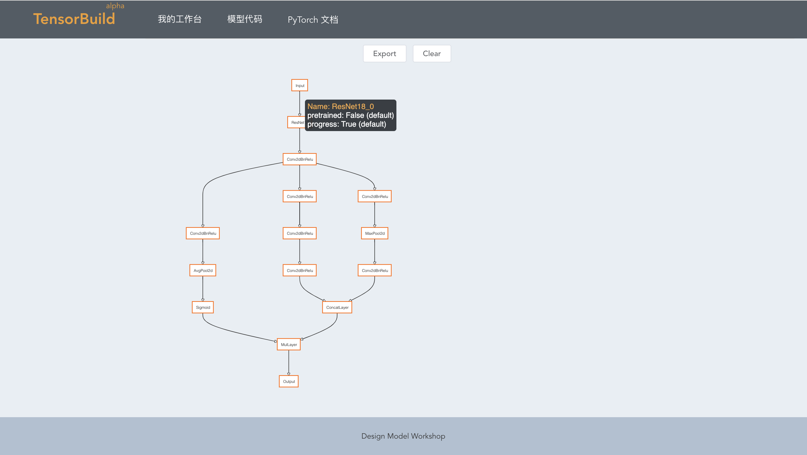

# TensorBuild

Deep Learning Designer Library for Scientists


## Docs
[中文文档](http://sxhxliang.github.io/docs/#/zh-cn/)

## Features

- Easy to build model
- Generate code immediately
- WYSIWYG(what you see is what you get)

## Online Demo

demo graph 


demo code


* [Demo](http://aaronleong.github.io/tensorbuild/)


## Development
I change some dependencies, so you can't run this project on your devices.

### Project setup
```
npm install
```

### Compiles and hot-reloads for development
```
npm run serve
```

### Compiles and minifies for production
```
npm run build
```

### Run your tests
```
npm run test
```

### Lints and fixes files
```
npm run lint
```
