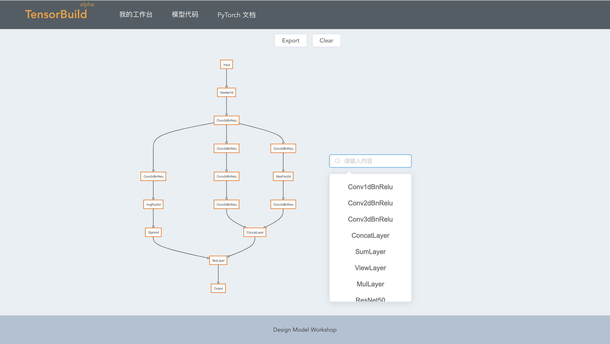
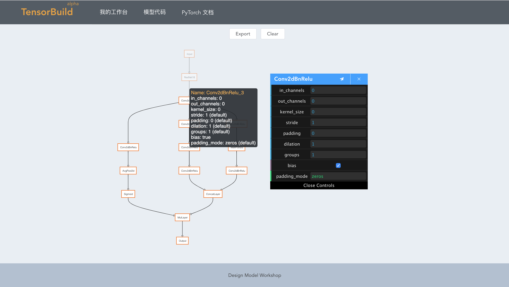
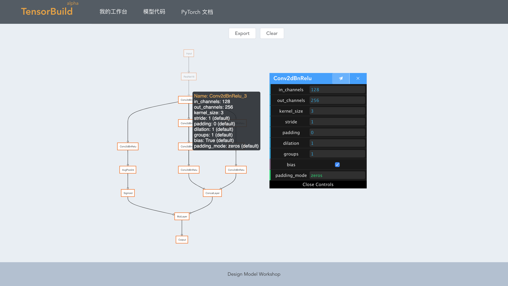
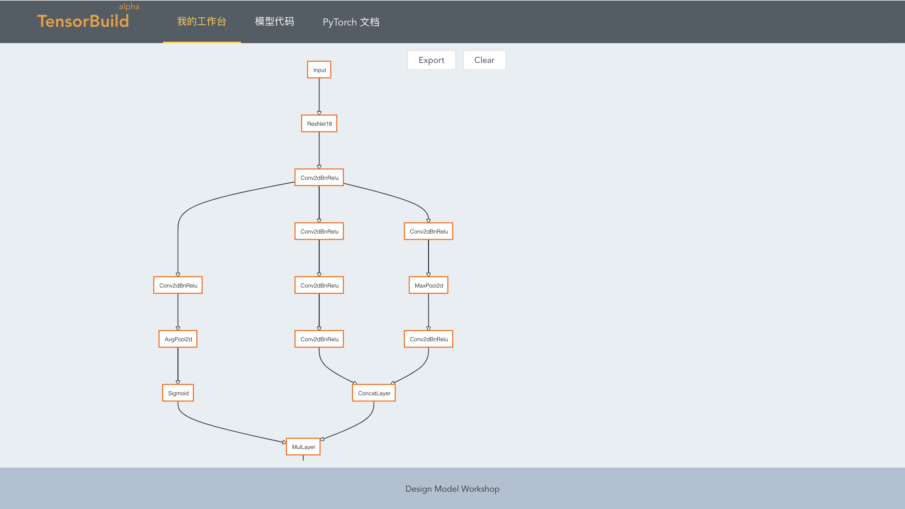
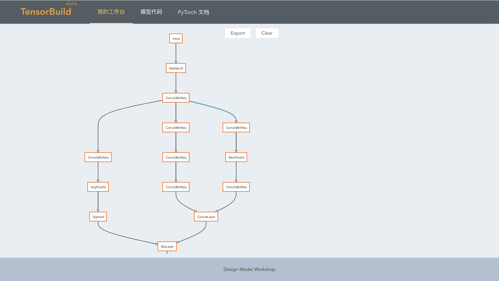
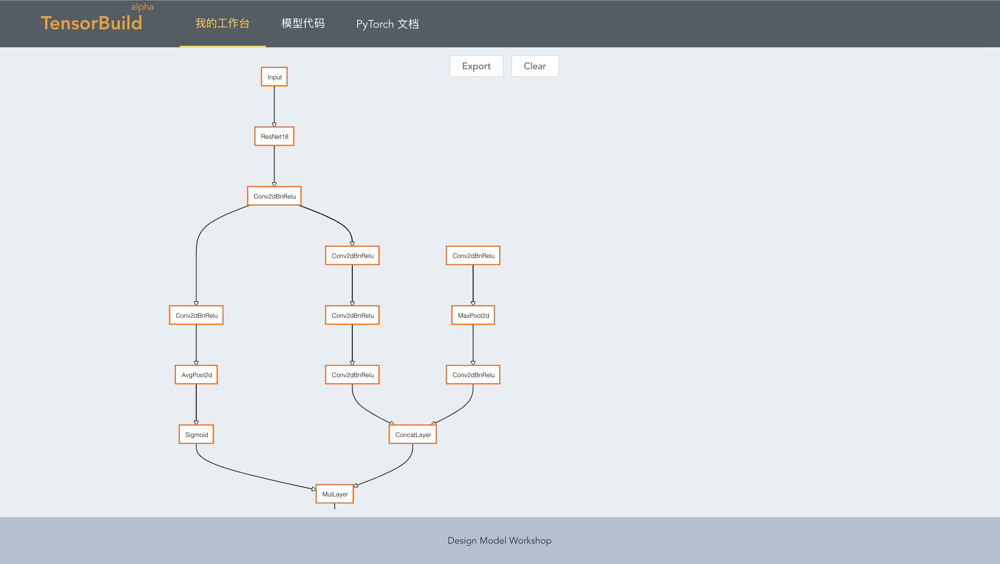
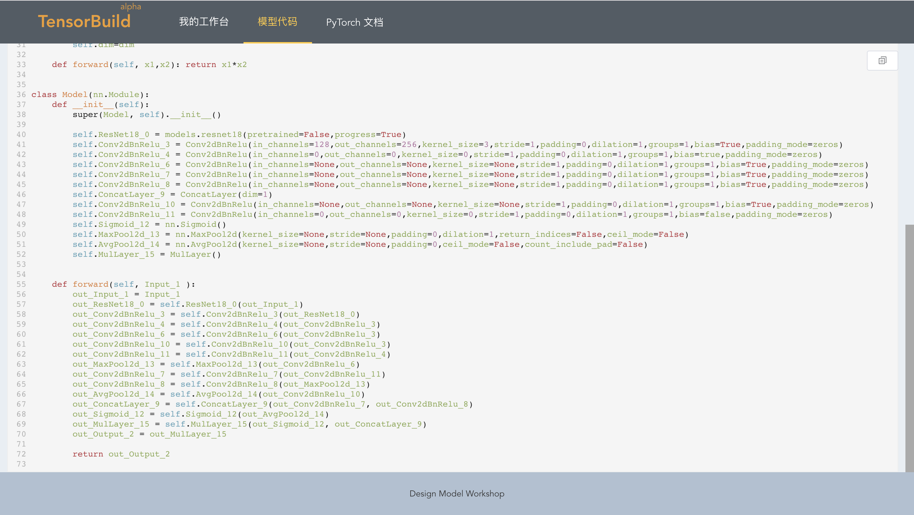

# 开始使用

> 一个深度学习模型代码生成器.

# 创建计算图

## 概念定义
> 计算图

计算图是深度学习模型的在编辑器中的定义。

> 计算节点

计算节点是计算图中最基本的计算单位，是一个具体的计算操作，如添加（Add）、乘法（Multipy）、也包括计算层。

> 计算层

计算层是在各大深度学习框架中的神经网络层，如Convlution Layer, Batch Normalization, Relu等，是计算节点的子集。

> 计算流

计算流是计算图中数据从一个计算节点的输出到下一个节点的输入的路径。

> Input & Output

Input 是整个计算的全局输入，也就是模型的输入， OutPut是全局输出，也就是模型的输入，
每个计算图都需要这两个定义，否则在生成的代码中不会定义输入输出，
需要手动的修改部分代码。

## 增加层

双击面板的空白区域，就会出现计算层的搜索框，可以通过搜索选择要添加的层，也可以直接滚动选择。

## 配置参数
双击计算节点就会弹出该节点的参数配置选项，可以根据自己的实际情况自由配置
值得注意的是，目前所有的节点的参数都不检查类型，你拥有完全的自主性，但是希望您真的了解您所有填的参数值。
每个计算节点都会有一些默认值，当当前的值是默认值得时候我们就会在值得后面提示（default）

填写完成后点击小飞机按钮就会保存，更新之后，可以把鼠标移动到计算几点上看参数有没有更新，如果没有可能是没点击保存按钮，否则就可以发现参数已经更新了。

## 节点连接

当需要一个节点的输出要进入另外一个节点的输入时，只需单击输出数据的节点，然后单击输入数据的节点就可以建立连接。

## 取消节点连接

只是移动鼠标到两个节点的边上，待到边变色，然后单击这个边就可以取消连接

点击所在的边后，节点就断开连接了

# 代码生成

## 代码预览
在模型代码页面可以预览计算图合成的代码，正如前面所说，当计算图中的部分节点没有配置参数是仍然可以生成代码，
因此可以先建立图然后统一配置参数。

## 复制代码

在代码页面的右上角有个复制按钮，点击即可把当前代码复制到系统的剪贴板。

# 计算节点

计算节点根据不同的后端框架有不同的配置，目前仅支持PyTorch。

## 通用计算节点

### Conv1dBnRelu
Conv1d + BatchNorm1d + Relu

### Conv2dBnRelu
Conv2d + BatchNorm2d + Relu

### Conv3dBnRelu
Conv3d + BatchNorm3d + Relu

### ConcatLayer

ConcatLayer 是把两个张量 Concat起来，

### SumLayer

SumLayer 两个张量相加

### ViewLayer
把一个张量的size变成另一个size

### MulLayer

MulLayer 两个张量相乘

## PyTorch

### nn 

目前支持几乎所有PyTorch的[nn](https://pytorch.org/docs/stable/nn.html) layer 和 [activations](https://pytorch.org/docs/stable/nn.html#non-linear-activations-weighted-sum-nonlinearity) 模块

### models

支持 所有的 [torchvision.models](https://pytorch.org/docs/stable/torchvision/models.html)

# 快捷键

## 复制节点
单击节点 后 Ctrl + C 复制节点。

## 粘贴节点
单击节点 后 Ctrl + V  粘贴节点，粘贴的节点会使用源节点的参数配置。

## 删除节点
单击节点 后 Ctrl + D 删除，删除节点后，相关的边也会被删除
